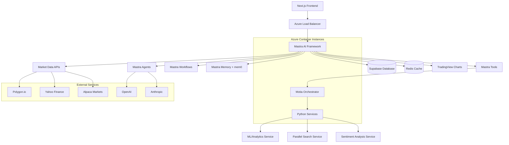

# Design Document

## Overview

The Fin Agent platform implements a hybrid microservices architecture combining Mastra's TypeScript-native AI framework with Motia-orchestrated Python services. The system uses Mastra for multi-agent debate, workflow orchestration, and memory management, while leveraging Motia for specialized Python services requiring ML libraries. The platform provides intelligent financial services including portfolio management, market analysis, parallel search, and real-time trading insights through a Next.js frontend, deployed as Docker containers on Microsoft Azure.

## Architecture

### High-Level Architecture



### Hybrid Architecture Design

**Mastra AI Framework (TypeScript)**
- Multi-agent orchestration and debate facilitation
- Workflow management for complex financial analysis
- Memory management with mem0 integration
- Tool interfaces to external services and Python components
- Built-in observability and API server

**Next.js Frontend**
- Assistant profile selection interface
- TradingView chart integration
- Asset comparison dashboards
- Real-time chat interface with agents
- Responsive design for desktop and mobile

**Motia-Orchestrated Python Services**
- ML/Analytics Service: Monte Carlo simulations, risk modeling
- Parallel Search Service: Multi-source financial data aggregation
- Sentiment Analysis Service: NLP processing of news and social media
- Quantitative Analysis Service: Complex mathematical computations

### Communication Patterns

- **Mastra Workflows**: Orchestration of multi-agent debates and complex analysis pipelines
- **Mastra Tools**: Interface between TypeScript agents and Motia-orchestrated Python services
- **Mastra Memory**: Persistent storage and retrieval of conversation context and user preferences
- **WebSocket**: Real-time market data streaming and portfolio updates
- **GraphQL/REST APIs**: Frontend-backend communication and external integrations
- **Azure Service Bus**: Inter-container communication and event messaging

## Components and Interfaces

### Mastra Agent Framework

```typescript
// Mastra Agent Configuration
interface FinancialAgent {
  name: string;
  instructions: string;
  model: {
    provider: 'OPENAI' | 'ANTHROPIC';
    name: string;
  };
  tools: MastraTool[];
  memory?: MastraMemory;
}

// Specialized Financial Agents
const agents = {
  general: new Agent({
    name: 'General Assistant',
    instructions: 'Provide balanced financial analysis and general advice...',
    model: { provider: 'OPENAI', name: 'gpt-4' }
  }),
  
  analyst: new Agent({
    name: 'Financial Analyst', 
    instructions: 'Perform deep fundamental and technical analysis...',
    tools: [quantAnalysisTool, chartAnalysisTool]
  }),
  
  trader: new Agent({
    name: 'Trading Assistant',
    instructions: 'Focus on short-term trading and market timing...',
    tools: [technicalIndicatorsTool, riskManagementTool]
  }),
  
  advisor: new Agent({
    name: 'Investment Advisor',
    instructions: 'Provide long-term investment strategy and planning...',
    tools: [portfolioOptimizationTool, allocationTool]
  }),
  
  riskManager: new Agent({
    name: 'Risk Manager',
    instructions: 'Assess portfolio risk and provide protection strategies...',
    tools: [riskAssessmentTool, hedgingTool]
  }),
  
  economist: new Agent({
    name: 'Macro Economist',
    instructions: 'Analyze economic trends and policy impacts...',
    tools: [economicDataTool, sectorAnalysisTool]
  })
};
```

### Mastra Workflows for Multi-Agent Debate

```typescript
// Multi-Agent Debate Workflow
const debateWorkflow = new Workflow({
  name: 'financial-analysis-debate',
  triggerSchema: z.object({
    query: z.string(),
    assistantType: z.enum(['general', 'analyst', 'trader', 'advisor', 'riskManager', 'economist']),
    symbols: z.array(z.string()).optional()
  })
});

debateWorkflow
  .step('parallel-search')
  .then('initial-analysis')
  .then('agent-debate')
  .then('consensus-building')
  .then('final-recommendation');

// Parallel Search Step
debateWorkflow.step('parallel-search', async ({ context }) => {
  const searchResults = await Promise.all([
    searchTool.execute({ source: 'news', query: context.query }),
    searchTool.execute({ source: 'sec-filings', query: context.query }),
    searchTool.execute({ source: 'social-media', query: context.query }),
    searchTool.execute({ source: 'market-data', symbols: context.symbols })
  ]);
  
  return { searchResults };
});

// Agent Debate Step  
debateWorkflow.step('agent-debate', async ({ context }) => {
  const participants = selectDebateParticipants(context.assistantType);
  
  const debate = await runMultiAgentDebate({
    participants,
    topic: context.query,
    evidence: context.searchResults,
    maxRounds: 3
  });
  
  return { debate };
});
```

### Mastra Tools Integration

**Market Data Tool:**
```typescript
const marketDataTool = new Tool({
  id: 'market-data',
  description: 'Fetch real-time and historical market data',
  inputSchema: z.object({
    symbol: z.string(),
    dataType: z.enum(['quote', 'historical', 'options', 'sentiment']),
    timeframe: z.string().optional()
  }),
  execute: async ({ symbol, dataType, timeframe }) => {
    // Fallback hierarchy: Polygon.io -> Alpaca -> Yahoo Finance
    try {
      return await polygonProvider.getData(symbol, dataType, timeframe);
    } catch (error) {
      try {
        return await alpacaProvider.getData(symbol, dataType, timeframe);
      } catch (fallbackError) {
        return await yahooProvider.getData(symbol, dataType, timeframe);
      }
    }
  }
});

const pythonAnalyticsTool = new Tool({
  id: 'python-analytics',
  description: 'Interface with Motia-orchestrated Python services',
  inputSchema: z.object({
    service: z.enum(['ml-analytics', 'sentiment-analysis', 'quant-analysis']),
    data: z.any(),
    operation: z.string()
  }),
  execute: async ({ service, data, operation }) => {
    return await motiaClient.callService(service, operation, data);
  }
});
```

### Next.js Frontend Components

**Assistant Selector:**
```typescript
interface AssistantProfile {
  id: string;
  name: string;
  description: string;
  color: string;
  icon: string;
  expertise: string[];
}

const AssistantSelector: React.FC = () => {
  const [selectedAssistant, setSelectedAssistant] = useState<AssistantProfile>(profiles.general);
  
  return (
    <DropdownMenu>
      <DropdownMenuTrigger>
        <AssistantButton assistant={selectedAssistant} />
      </DropdownMenuTrigger>
      <DropdownMenuContent>
        {profiles.map(profile => (
          <AssistantOption 
            key={profile.id}
            profile={profile}
            onSelect={setSelectedAssistant}
          />
        ))}
      </DropdownMenuContent>
    </DropdownMenu>
  );
};
```

**TradingView Chart Integration:**
```typescript
const TradingViewChart: React.FC<{ symbol: string }> = ({ symbol }) => {
  useEffect(() => {
    new TradingView.widget({
      container_id: 'tradingview-chart',
      symbol: symbol,
      datafeed: new PolygonDatafeed(),
      library_path: '/charting_library/',
      theme: 'dark',
      toolbar_bg: '#1a1a1a',
      studies_overrides: {},
      overrides: {
        'paneProperties.background': '#1a1a1a',
        'paneProperties.vertGridProperties.color': '#2a2a2a'
      }
    });
  }, [symbol]);
  
  return <div id="tradingview-chart" className="h-96 w-full" />;
};
```

## Data Models

### Database Schema (Supabase)

**Core Tables:**

```sql
-- Portfolios and Accounts
CREATE TABLE portfolios (
  id UUID PRIMARY KEY DEFAULT gen_random_uuid(),
  user_id UUID REFERENCES auth.users(id),
  name TEXT NOT NULL,
  description TEXT,
  created_at TIMESTAMPTZ DEFAULT NOW(),
  updated_at TIMESTAMPTZ DEFAULT NOW()
);

CREATE TABLE accounts (
  id UUID PRIMARY KEY DEFAULT gen_random_uuid(),
  portfolio_id UUID REFERENCES portfolios(id),
  broker_name TEXT NOT NULL,
  account_number TEXT NOT NULL,
  account_type TEXT NOT NULL,
  is_active BOOLEAN DEFAULT true
);

CREATE TABLE positions (
  id UUID PRIMARY KEY DEFAULT gen_random_uuid(),
  account_id UUID REFERENCES accounts(id),
  symbol TEXT NOT NULL,
  quantity DECIMAL NOT NULL,
  average_cost DECIMAL NOT NULL,
  current_price DECIMAL,
  market_value DECIMAL,
  unrealized_pnl DECIMAL,
  updated_at TIMESTAMPTZ DEFAULT NOW()
);

-- Market Data
CREATE TABLE tickers (
  symbol TEXT PRIMARY KEY,
  company_name TEXT,
  sector TEXT,
  industry TEXT,
  market_cap BIGINT,
  created_at TIMESTAMPTZ DEFAULT NOW()
);

CREATE TABLE price_history (
  id UUID PRIMARY KEY DEFAULT gen_random_uuid(),
  symbol TEXT REFERENCES tickers(symbol),
  timestamp TIMESTAMPTZ NOT NULL,
  open_price DECIMAL NOT NULL,
  high_price DECIMAL NOT NULL,
  low_price DECIMAL NOT NULL,
  close_price DECIMAL NOT NULL,
  volume BIGINT NOT NULL,
  adjusted_close DECIMAL
);

CREATE TABLE options_flow (
  id UUID PRIMARY KEY DEFAULT gen_random_uuid(),
  symbol TEXT REFERENCES tickers(symbol),
  strike_price DECIMAL NOT NULL,
  expiration_date DATE NOT NULL,
  option_type TEXT NOT NULL CHECK (option_type IN ('call', 'put')),
  volume BIGINT NOT NULL,
  open_interest BIGINT,
  premium DECIMAL,
  timestamp TIMESTAMPTZ DEFAULT NOW()
);

-- Sentiment Analysis
CREATE TABLE sentiment_data (
  id UUID PRIMARY KEY DEFAULT gen_random_uuid(),
  symbol TEXT REFERENCES tickers(symbol),
  source TEXT NOT NULL,
  content TEXT NOT NULL,
  sentiment_score DECIMAL NOT NULL CHECK (sentiment_score BETWEEN -1 AND 1),
  confidence DECIMAL NOT NULL CHECK (confidence BETWEEN 0 AND 1),
  embedding VECTOR(1536), -- OpenAI embedding dimension
  timestamp TIMESTAMPTZ DEFAULT NOW()
);

-- Agent Execution
CREATE TABLE agent_executions (
  id UUID PRIMARY KEY DEFAULT gen_random_uuid(),
  user_id UUID REFERENCES auth.users(id),
  query TEXT NOT NULL,
  agent_name TEXT NOT NULL,
  status TEXT NOT NULL DEFAULT 'pending',
  result JSONB,
  error_message TEXT,
  execution_time_ms INTEGER,
  created_at TIMESTAMPTZ DEFAULT NOW(),
  completed_at TIMESTAMPTZ
);

CREATE TABLE agent_dependencies (
  id UUID PRIMARY KEY DEFAULT gen_random_uuid(),
  execution_id UUID REFERENCES agent_executions(id),
  depends_on_execution_id UUID REFERENCES agent_executions(id),
  created_at TIMESTAMPTZ DEFAULT NOW()
);
```

**Row-Level Security Policies:**

```sql
-- Users can only access their own portfolios
CREATE POLICY "Users can view own portfolios" ON portfolios
  FOR SELECT USING (auth.uid() = user_id);

CREATE POLICY "Users can modify own portfolios" ON portfolios
  FOR ALL USING (auth.uid() = user_id);

-- Similar policies for accounts, positions, and agent_executions
```

### TypeScript Schemas (Zod)

```typescript
import { z } from 'zod';

export const PortfolioSchema = z.object({
  id: z.string().uuid(),
  user_id: z.string().uuid(),
  name: z.string().min(1).max(100),
  description: z.string().optional(),
  created_at: z.string().datetime(),
  updated_at: z.string().datetime()
});

export const PositionSchema = z.object({
  id: z.string().uuid(),
  account_id: z.string().uuid(),
  symbol: z.string().min(1).max(10),
  quantity: z.number(),
  average_cost: z.number().positive(),
  current_price: z.number().positive().optional(),
  market_value: z.number().optional(),
  unrealized_pnl: z.number().optional()
});

export const AgentQuerySchema = z.object({
  query: z.string().min(1),
  context: z.object({
    user_id: z.string().uuid(),
    portfolio_id: z.string().uuid().optional(),
    symbols: z.array(z.string()).optional()
  })
});
```

## Error Handling

### Error Classification

```typescript
enum ErrorType {
  VALIDATION = 'validation',
  AUTHENTICATION = 'authentication',
  AUTHORIZATION = 'authorization',
  NOT_FOUND = 'not_found',
  EXTERNAL_SERVICE = 'external_service',
  AGENT_EXECUTION = 'agent_execution',
  RATE_LIMIT = 'rate_limit',
  INTERNAL = 'internal'
}

class FinAgentError extends Error {
  constructor(
    public type: ErrorType,
    public message: string,
    public statusCode: number,
    public details?: any
  ) {
    super(message);
  }
}
```

### Error Handling Strategy

1. **Input Validation**: Zod schema validation with detailed error messages
2. **Service Failures**: Circuit breaker pattern with fallback providers
3. **Agent Errors**: Graceful degradation with partial results
4. **Database Errors**: Transaction rollback and retry logic
5. **External API Failures**: Provider failover and caching fallback

### Logging and Monitoring

```typescript
interface LogContext {
  userId?: string;
  executionId?: string;
  agentName?: string;
  symbol?: string;
  duration?: number;
}

class Logger {
  info(message: string, context?: LogContext): void;
  warn(message: string, context?: LogContext): void;
  error(message: string, error: Error, context?: LogContext): void;
}
```

## Testing Strategy

### Unit Testing
- **Framework**: Jest with TypeScript support
- **Coverage**: Minimum 80% code coverage
- **Scope**: Individual functions, classes, and modules
- **Mocking**: External services, database calls, and LLM providers

### Integration Testing
- **Database**: Test with Supabase local instance
- **APIs**: Test service-to-service communication
- **External Services**: Mock external providers with realistic responses
- **Real-time**: Test WebSocket and SSE functionality

### End-to-End Testing
- **User Flows**: Complete portfolio management workflows
- **Agent Orchestration**: Multi-agent execution scenarios
- **Performance**: Load testing with realistic data volumes
- **Security**: Authentication and authorization testing

### Testing Data
- **Market Data**: Historical datasets for backtesting
- **Portfolios**: Synthetic portfolio data with various scenarios
- **Sentiment**: Sample news and social media data
- **Agent Queries**: Comprehensive query test suite

## Azure Deployment Architecture

### Container Orchestration
- **Azure Container Instances**: Serverless container deployment for Mastra and Motia services
- **Azure Kubernetes Service**: Optional for advanced orchestration and scaling requirements
- **Docker Images**: Multi-stage builds for optimized container sizes
- **Azure Container Registry**: Private registry for storing application images

### Security & Compliance
- **Azure Active Directory**: Integration with Supabase Auth for enterprise SSO
- **Azure Key Vault**: Secure storage of API keys, database credentials, and certificates
- **Azure Application Gateway**: WAF protection and SSL termination
- **Network Security Groups**: Firewall rules and network isolation
- **Azure Monitor**: Security event detection and compliance logging

### Scalability & Performance
- **Azure Load Balancer**: Traffic distribution across container instances
- **Azure Redis Cache**: Distributed caching for market data and session storage
- **Azure CDN**: Global content delivery for static assets
- **Auto-scaling**: Container instance scaling based on CPU/memory metrics

## Performance Optimization

### Caching Strategy
- **Redis**: Multi-level caching for market data and analytics
- **Application Cache**: In-memory caching for frequently accessed data
- **CDN**: Static asset delivery optimization
- **Database**: Query optimization and connection pooling

### Scalability Design
- **Horizontal Scaling**: Stateless services with load balancing
- **Database Scaling**: Read replicas and connection pooling
- **Queue Management**: Redis-based job queues for heavy processing
- **Resource Management**: CPU and memory limits with auto-scaling

### Real-time Optimization
- **WebSocket Pooling**: Efficient connection management
- **Event Batching**: Reduce message frequency for high-volume updates
- **Selective Updates**: Only send relevant data to subscribed clients
- **Compression**: Message compression for large payloads